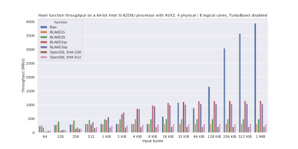
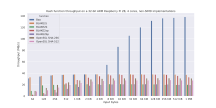

# Bao [](https://travis-ci.org/oconnor663/bao) [](https://docs.rs/bao) [](https://crates.io/crates/bao)

[Spec](docs/spec.md) —
[Rust Crate](https://crates.io/crates/bao) —
[Rust Docs](https://docs.rs/bao)

> **Caution!** Not yet suitable for production use. The output of Bao
> isn't stable. There might be more changes before 1.0.

Bao (rhymes with bough 🌳) is a general-purpose cryptographic tree hash.
Here's the [full specification](docs/spec.md) and a [talk about the
design](https://youtu.be/Dya9c2DXMqQ). Unlike a serial hash function, a
tree hash allows the implementation to split up its input and work in
parallel. On modern hardware with multiple cores and SIMD instructions,
that makes a dramatic difference in performance:


Bao also performs well on short messages and 32-bit systems. It's based
on the [BLAKE2s](https://blake2.net/) hash function, which was designed
for those use cases:

[](https://raw.githubusercontent.com/oconnor663/bao/master/docs/x86.svg?sanitize=true)[](https://raw.githubusercontent.com/oconnor663/bao/master/docs/rpi2.svg?sanitize=true)

## Streaming Verification

Tree hashes make it possible to verify part of a file without re-hashing
the entire thing. Bao defines an encoding format, which stores an input
together with all the nodes of its hash tree. Clients can stream this
encoding, or do random seeks into it, while verifying that every byte
they read matches the root hash.

Use case: A secure messaging app might support attachment files by
including the hash of an attachment in the metadata of a message. With a
serial hash, the recipient would need to download the entire attachment
to verify it, but that can be impractical for things like large video
files. With a tree hash like Bao, the recipient can stream a video
attachment, while still verifying each byte as it comes in. (This
scenario was the original motivation for the Bao project.)

```sh
# Create an input file that's a megabyte of random data.
> head -c 1000000 /dev/urandom > f

# Convert it into a Bao encoded file.
> bao encode f f.bao

# Compare the size of the two files. The encoding overhead is small.
> stat -c "%n %s" f f.bao | column -t
f       1000000
f.bao   1015624

# Compute the hash of the original file.
> hash=`bao hash f`

# Stream decoded bytes from the encoded file, using the hash above.
> bao decode $hash f.bao f2
> cmp f f2

# Observe that using the wrong hash to decode results in an error. This
# is also what will happen if we use the right hash but corrupt some
# bytes in the encoded file.
> bad_hash="0000000000000000000000000000000000000000000000000000000000000000"
> bao decode $bad_hash f.bao f3
Error: Custom { kind: InvalidData, error: StringError("hash mismatch") }
```

## Verifying Slices

Encoded files support random seeking, but seeking might not be available
or efficient over the network. (Note that one seek in the content
usually requires several seeks in the encoding, as the decoder traverses
the hash tree level-by-level.) In these situations, rather than trying
to seek remotely, clients can instead request an encoded slice
containing the range of content bytes they need. Creating a slice
requires the sender to seek over the full encoding, but the recipient
can then stream the slice without seeking at all. Decoding a slice uses
the same root hash as regular decoding, so it doesn't require any
preparation in advance from the sender or the recipient.

Use case: A BitTorrent-like application could fetch different slices of
a file from different peers, without needing to define the slices ahead
of time. Or a distributed file storage application could request random
slices of an archived file from its storage providers, to prove that
they're honestly storing the file, without needing to prepare or store
challenges for the future.

```sh
# Using the encoded file from above, extract a 100 KB slice from
# somewhere in the middle. We'll use start=500000 (500 KB) and
# count=100000 (100 KB).
> bao slice 500000 100000 f.bao f.slice

# Look at the size of the slice. It contains the 100 KB of content plus
# some overhead. Again, the overhead is small.
> stat -c "%n %s" f.slice
f.slice 104584

# Using the same parameters we used to create the slice, plus the same
# hash we got above from the full encoding, decode the slice.
> bao decode-slice $hash 500000 100000 f.slice > f.slice.out

# Confirm that the decoded output matches the corresponding section from
# the input file. (Note that `tail` numbers bytes starting with 1.)
> tail --bytes=+500001 f | head -c 100000 > expected.out
> cmp f.slice.out expected.out

# Now try decoding the slice with the wrong hash. Again, this will fail,
# as it would if we corrupted some bytes in the slice.
> bao decode-slice $bad_hash 500000 100000 f.slice
Error: Custom { kind: InvalidData, error: StringError("hash mismatch") }
```

## Outboard Mode

By default, all of the operations above work with a "combined" encoded
file, that is, one that contains both the content bytes and the tree
hash bytes interleaved. However, sometimes you want to keep them
separate, for example to avoid duplicating a very large input file. In
these cases, you can use the "outboard" encoding format, via the
`--outboard` flag:

```sh
# Re-encode the input file from above in the outboard mode.
> bao encode f --outboard f.obao

# Compare the size of all these files. The size of the outboard file is
# equal to the overhead of the original combined file.
> stat -c "%n %s" f f.bao f.obao | column -t
f       1000000
f.bao   1015624
f.obao  15624

# Decode the whole file in outboard mode. Note that both the original
# input file and the outboard encoding are passed in as arguments.
> cmp f <(bao decode $hash f --outboard f.obao)
```

## Installation and Building From Source

The `bao` command line utility is published on
[crates.io](https://crates.io) as the
[`bao_bin`](https://crates.io/crates/bao_bin) crate. To install it, add
`~/.cargo/bin` to your `PATH` and then run:

```sh
cargo install bao_bin
```

To build the binary directly from this repo:

```sh
git clone https://github.com/oconnor663/bao
cd bao/bao_bin
cargo build --release
./target/release/bao --help
```

[`tests/bao.py`](tests/bao.py) is a fully functional second
implementation in Python, designed to be as short and readable as
possible. It's a good starting point for understanding the algorithms
involved, before diving into the Rust code.

The `bao` library crate includes `no_std` support if you set
`default-features = false` in your `Cargo.toml`. The `encode` and
`decode` modules currently depend `std` for the `Read`, `Write`, and
`Seek` traits.
